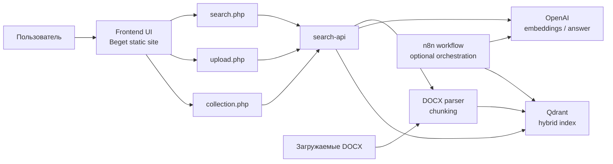
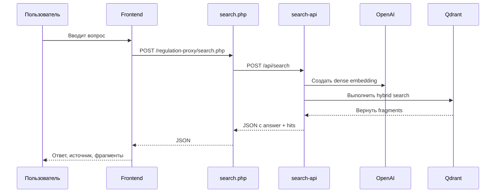
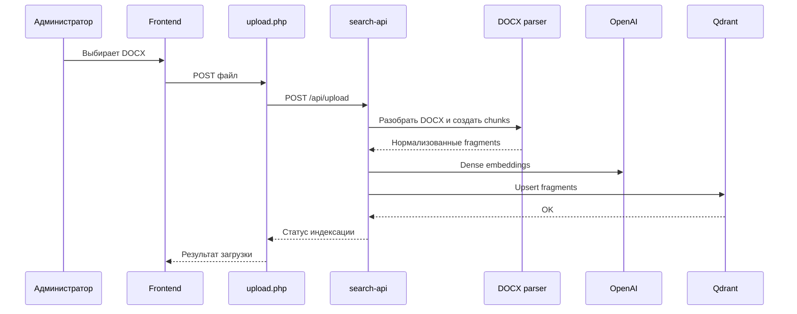

# Проект: Regulation Search

## 1. Назначение проекта

`Regulation Search` это поисковая система по корпоративным регламентам, ориентированная на сложные Word-документы с таблицами, многоуровневой нумерацией и неунифицированным оформлением.

Проект решает три практические задачи:

1. Дать сотруднику быстрый ответ на вопрос по регламентам без ручного чтения нескольких `docx`.
2. Сохранить ссылку на источник: документ, раздел, подпункт или табличный фрагмент.
3. Обеспечить управляемую индексацию новых регламентов через интерфейс без ручной работы с базой.

Основной сценарий использования:

- пользователь задает вопрос на естественном языке;
- система находит релевантные фрагменты в регламентах;
- интерфейс показывает краткий ответ и подтверждающие цитаты;
- администратор может загрузить новые `docx` и обновить индекс.

## 2. Что именно является объектом поиска

Система работает не с "документом целиком", а с нормализованными поисковыми фрагментами:

- абзацы регламента;
- важные примечания;
- строки таблиц;
- части длинных абзацев, если они превышают лимит размера;
- фрагменты с сохранением контекста раздела.

Это важно, потому что в реальных регламентах ответ часто находится:

- в строке таблицы;
- в подпункте вида `2.1.4`;
- в примечании;
- в длинном абзаце, который нужно корректно разбить на несколько кусков.

## 3. Логика решения

Проект построен как гибридная поисковая система:

- `dense search` отвечает за поиск по смыслу;
- `sparse search` отвечает за точные формулировки и терминологию;
- итоговый результат собирается через гибридный поиск в `Qdrant`;
- пользовательский интерфейс работает через собственные `PHP` proxy, чтобы не упираться в `CORS` и не светить внутренние URL.

Архитектурно решение разделено на четыре слоя:

1. Слой данных: исходные `docx` и подготовленные chunks.
2. Слой индексации: парсинг `docx`, извлечение фрагментов, построение эмбеддингов, загрузка в `Qdrant`.
3. Слой поиска: `search-api`, `Qdrant`, OpenAI и служебная оркестрация.
4. Слой интерфейса: фронтенд на Beget и proxy-слой для вызова backend.

## 4. Состав компонентов

### 4.1. Компоненты репозитория

| Компонент | Файл / каталог | Назначение |
| --- | --- | --- |
| Корпус регламентов | внешний набор `docx` | Исходные файлы для индексации, которые не хранятся в Git |
| Парсер `docx` | `src/regulation_search/docx_parser.py` | Извлекает текст, заголовки, таблицы и формирует chunks |
| Индексатор | `src/regulation_search/qdrant_indexer.py` | Создает dense и sparse представления и загружает их в `Qdrant` |
| Конфигурация | `src/regulation_search/config.py` | Управляет путями, моделями, лимитами chunking и подключением к `Qdrant` |
| Локальные утилиты ingestion | `scripts/` | Выполняют парсинг и локальную индексацию корпуса |
| Локальный `Qdrant` | `docker-compose.yml` | Поднимает контейнер `Qdrant` для локальной разработки |
| Веб-интерфейс | `site/index.html`, `site/styles.css`, `site/app.js` | Поиск, загрузка документов, просмотр статуса коллекции |
| Search proxy | `site/regulation-proxy/search.php` | Проксирует поисковые запросы в backend |
| Upload proxy | `site/regulation-proxy/upload.php` | Проксирует загрузку документов в backend |
| Collection proxy | `site/regulation-proxy/collection.php` | Получает статус коллекции и очищает ее |
| `n8n` workflow | `n8n/regulation_search_hybrid.json` | Референсная схема гибридного поиска через `n8n` |

### 4.2. Внешние и инфраструктурные компоненты

| Компонент | Роль в системе |
| --- | --- |
| Frontend hosting на Beget | Публикация интерфейса для пользователей |
| `PHP` proxy на Beget | Same-origin проксирование запросов к backend |
| `search-api` | Публичный backend для поиска, загрузки и работы с коллекцией |
| `Qdrant` | Хранение индекса и выполнение гибридного поиска |
| OpenAI | Dense embeddings и генерация финального ответа |
| `n8n` | Оркестрация и расширение сценариев поиска / автоматизации |

## 5. Компонентная схема

## 6. Подробное описание ролей компонентов

### 6.1. Корпус регламентов

Корпус регламентов это исходный набор `docx`, который используется как первичный источник знаний на этапе локальной подготовки, тестов и индексации.

Ключевая особенность проекта в том, что документы:

- разнородны по стилям Word;
- могут содержать merge-ячейки в таблицах;
- используют нумерацию разделов вместо строгих heading styles;
- хранят важные правила как в тексте, так и в таблицах.

Поэтому проект не опирается на "плоский текст", а строит структурированный индекс.

### 6.2. `docx_parser.py`

Парсер отвечает за структурное чтение `docx`:

- читает OOXML через `zipfile` и `xml.etree.ElementTree`;
- нормализует текст;
- распознает заголовки через нумерацию и стили;
- формирует `section_path`;
- выделяет блоки типов `paragraph`, `important`, `table_row`;
- режет длинные фрагменты на chunks;
- формирует `citation` и метаданные для последующего показа в UI.

По сути это главный слой подготовки знаний к поиску.

### 6.3. `qdrant_indexer.py`

Индексатор связывает парсинг с векторной базой:

- создает dense embeddings через OpenAI;
- создает sparse embeddings через `Qdrant/bm25`;
- инициализирует коллекцию с двумя типами векторов;
- индексирует payload-поля `doc_id`, `doc_title`, `block_type`, `source_file`;
- загружает points в `Qdrant`.

Именно этот компонент делает поиск гибридным, а не только семантическим.

### 6.4. `Qdrant`

`Qdrant` хранит поисковый индекс и обеспечивает:

- хранение dense-векторов;
- хранение sparse-векторов;
- гибридный запрос по нескольким представлениям;
- быстрый retrieval с payload;
- административные операции по очистке и пересозданию коллекции.

В локальной разработке `Qdrant` поднимается через `docker-compose.yml`.
В продовом контуре он работает как отдельный контейнер рядом с backend.

### 6.5. `search-api`

`search-api` это прикладной backend проекта. Он не хранится в этом репозитории целиком, но является частью фактической продовой архитектуры.

Он выполняет три ключевые функции:

1. Принимает поисковый запрос.
2. Принимает загружаемый `docx`, запускает парсинг и индексацию.
3. Отдает статус коллекции и управляет ее очисткой.

Именно поэтому пользовательский фронт общается не напрямую с `Qdrant`, а с прикладным API.

### 6.6. `n8n`

В репозитории лежит workflow `n8n/regulation_search_hybrid.json`, который показывает альтернативный или расширяемый путь оркестрации поиска:

- прием webhook-запроса;
- нормализация параметров;
- получение dense embedding;
- hybrid query в `Qdrant`;
- формирование ответа для клиента.

Роль `n8n` в проекте:

- оркестрация бизнес-логики без hardcoding во фронтенде;
- возможность быстро менять сценарии;
- интеграция с другими системами без переписывания всего backend.

### 6.7. Frontend

Статический фронтенд в `site/` решает две разные задачи:

- пользовательский поиск по регламентам;
- административную загрузку документов и контроль состояния индекса.

Функции интерфейса:

- вкладка поиска;
- вкладка загрузки документов;
- отправка запросов в backend;
- показ ответа и подтверждающих фрагментов;
- локальная история запросов;
- индикация статуса коллекции;
- очистка коллекции;
- индексация новых `docx`.

### 6.8. `PHP` proxy

Прокси-слой нужен, чтобы фронтенд работал с backend по same-origin схеме.

Это решает сразу несколько задач:

- устраняет `CORS`-проблемы;
- не раскрывает клиенту внутренние backend URL напрямую;
- упрощает замену backend без переписывания UI;
- позволяет иметь единый внешний домен для фронта.

## 7. Ключевые сценарии работы

### 7.1. Сценарий поиска

1. Пользователь открывает вкладку поиска.
2. Вводит вопрос в свободной форме.
3. Фронтенд отправляет запрос в `search.php`.
4. Proxy перенаправляет запрос в `search-api`.
5. Backend получает dense embedding и формирует гибридный запрос.
6. `Qdrant` возвращает релевантные fragments.
7. Backend собирает ответ и возвращает список подтверждающих фрагментов.
8. UI показывает:
   - короткий ответ;
   - источник;
   - список найденных фрагментов;
   - историю запросов.

### 7.2. Сценарий загрузки и индексации

1. Администратор открывает вкладку загрузки.
2. Выбирает один или несколько `docx`.
3. Фронтенд отправляет файл через `upload.php`.
4. Proxy пересылает файл в `search-api`.
5. Backend:
   - сохраняет файл;
   - парсит его;
   - режет на chunks;
   - получает embeddings;
   - загружает fragments в `Qdrant`.
6. UI показывает успешную индексацию и обновленный статус коллекции.

### 7.3. Сценарий очистки коллекции

1. Администратор нажимает `Очистить коллекцию`.
2. Фронтенд вызывает `collection.php` методом `DELETE`.
3. Proxy пересылает запрос в backend.
4. Backend очищает индекс и тут же пересоздает пустую рабочую коллекцию.
5. UI обновляет счетчик фрагментов и статус коллекции.

## 8. Схема потоков данных

### 8.1. Поисковый поток

### 8.2. Поток индексации

## 9. Структура данных и индекс

Каждый chunk хранит как минимум:

- `id`
- `doc_id`
- `doc_title`
- `source_file`
- `section_path`
- `block_type`
- `block_index`
- `chunk_index`
- `text`
- `raw_text`
- `citation`
- `table_index`
- `row_index`

Это дает проекту два преимущества:

1. Можно объяснить пользователю, откуда взят ответ.
2. Можно дорабатывать ранжирование, фильтры и административные функции без переделки формата данных.

## 10. Локальная и продовая схема

### Локальный контур

- `docker compose up -d` поднимает `Qdrant`;
- локальные утилиты ingestion подготавливают chunks;
- локальные утилиты индексации загружают корпус в `Qdrant`;
- разработчик тестирует retrieval локально.

### Продовый контур

- фронтенд размещен на Beget;
- frontend вызывает `PHP` proxy;
- proxy вызывает `search-api`;
- `search-api` работает с `Qdrant` и OpenAI;
- `n8n` доступен как orchestration-слой для расширения логики.

## 11. Почему такая архитектура выбрана

Эта архитектура практична для текущего сценария по нескольким причинам:

- `docx` с таблицами лучше парсить на Python, а не в браузере;
- гибридный поиск лучше работает по регламентам, чем один только semantic search;
- `Qdrant` удобно хранит dense и sparse представления в одной коллекции;
- `PHP` proxy упрощает публикацию фронта на обычном хостинге;
- `n8n` позволяет быстро наращивать оркестрацию без тяжелого рефакторинга.

Иными словами, проект отделяет:

- ingestion и indexing;
- retrieval и answer generation;
- пользовательский UI и backend-интеграции;
- локальную разработку и продовую эксплуатацию.

## 12. Текущий статус проекта

На текущем этапе проект уже покрывает базовый MVP:

- поиск по регламентам;
- загрузка `docx`;
- показ ответа и источников;
- управление коллекцией `Qdrant`;
- локальный и продовый контур;
- референсный `n8n` workflow для гибридного поиска.

Следующий логичный этап развития:

1. Нормализовать названия и версии документов на уровне backend.
2. Добавить более строгий answer-generation поверх retrieved fragments.
3. Ввести роли доступа для административных функций.
4. Добавить мониторинг индексации и журнал загрузок.
5. Вынести конфигурацию коллекций и политик chunking в отдельный административный слой.
