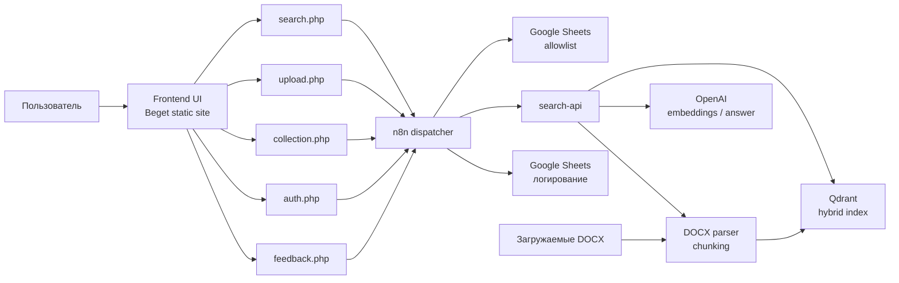
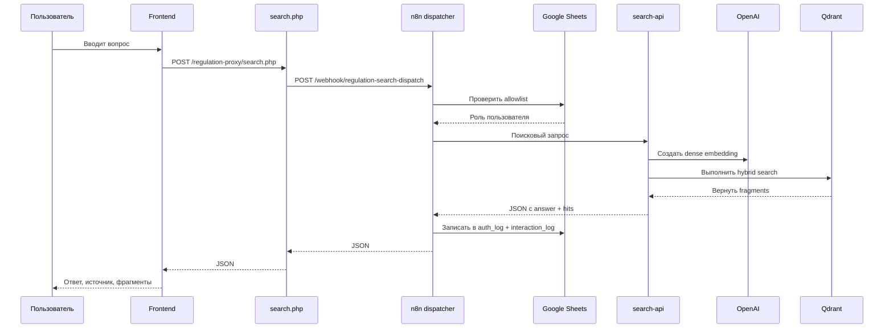
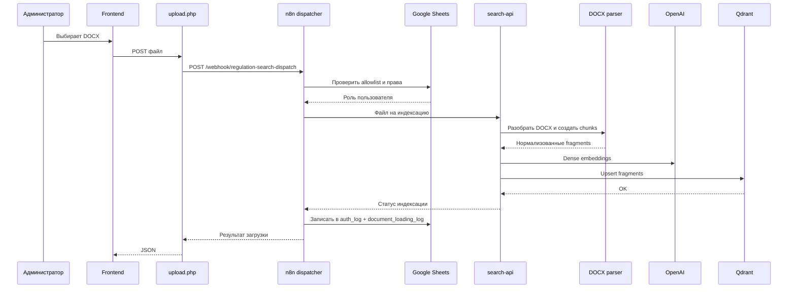

# Проект: Помощник для сотрудников

## 1. Назначение проекта

`Помощник для сотрудников` это поисковая система по корпоративным регламентам, ориентированная на сложные Word-документы с таблицами, многоуровневой нумерацией и неунифицированным оформлением.

Проект решает три практические задачи:

1. Дать сотруднику быстрый ответ на вопрос по регламентам без ручного чтения нескольких `docx`.
2. Сохранить ссылку на источник: документ, раздел, подпункт или табличный фрагмент.
3. Обеспечить управляемую индексацию новых регламентов через интерфейс без ручной работы с базой.

Основной сценарий использования:

- пользователь задает вопрос на естественном языке;
- система находит релевантные фрагменты в регламентах;
- интерфейс показывает краткий ответ и подтверждающие цитаты;
- пользователь может оценить полезность ответа;
- администратор может загрузить новые `docx` и обновить индекс.

## Документы проекта

- Краткое описание: [PROJECT_ONE_PAGER.md](PROJECT_ONE_PAGER.md)
- Обследование проекта: [Обследование.md](Обследование.md)
- Схема логирования: [LOGGING_SCHEMA.md](LOGGING_SCHEMA.md)
- Runbook деплоя логирования: [LOGGING_DEPLOY_RUNBOOK.md](LOGGING_DEPLOY_RUNBOOK.md)
- Smoke test checklist: [LOGGING_SMOKE_TEST_CHECKLIST.md](LOGGING_SMOKE_TEST_CHECKLIST.md)

## 2. Что именно является объектом поиска

Система работает не с "документом целиком", а с нормализованными поисковыми фрагментами:

- абзацы регламента;
- важные примечания;
- строки таблиц;
- части длинных абзацев, если они превышают лимит размера;
- фрагменты с сохранением контекста раздела.

Это важно, потому что в реальных регламентах ответ часто находится:

- в строке таблицы;
- в подпункте вида `2.1.4`;
- в примечании;
- в длинном абзаце, который нужно корректно разбить на несколько кусков.

## 3. Логика решения

Проект построен как гибридная поисковая система:

- `dense search` отвечает за поиск по смыслу (OpenAI `text-embedding-3-large`);
- `sparse search` отвечает за точные формулировки и терминологию (`Qdrant/bm25` через `fastembed`);
- итоговый результат собирается через гибридный поиск в `Qdrant`;
- пользовательский интерфейс работает через собственные `PHP` proxy, чтобы не упираться в `CORS` и не светить внутренние URL;
- все запросы маршрутизируются через `n8n` dispatcher, который обеспечивает авторизацию, маршрутизацию и логирование.

Архитектурно решение разделено на четыре слоя:

1. Слой данных: исходные `docx` и подготовленные chunks.
2. Слой индексации: парсинг `docx`, извлечение фрагментов, построение эмбеддингов, загрузка в `Qdrant`.
3. Слой оркестрации и поиска: `n8n` dispatcher, `search-api`, `Qdrant`, OpenAI.
4. Слой интерфейса: фронтенд на Beget и proxy-слой для вызова backend.

## 4. Состав компонентов

### 4.1. Компоненты репозитория

| Компонент | Файл / каталог | Назначение |
| --- | --- | --- |
| Корпус регламентов | внешний набор `docx` | Исходные файлы для индексации, которые не хранятся в Git |
| Парсер `docx` | `src/regulation_search/docx_parser.py` | Извлекает текст, заголовки, таблицы и формирует chunks |
| Индексатор | `src/regulation_search/qdrant_indexer.py` | Создает dense и sparse представления и загружает их в `Qdrant` |
| Конфигурация | `src/regulation_search/config.py` | Управляет путями, моделями, лимитами chunking и подключением к `Qdrant` |
| Ingest API | `src/regulation_search/ingest_api.py` | FastAPI-микросервис для healthcheck, загрузки и индексации DOCX |
| Локальные утилиты ingestion | `scripts/parse_documents.py`, `scripts/index_documents.py` | Выполняют парсинг и локальную индексацию корпуса |
| Deploy bundle builder | `scripts/build_logging_deploy_bundle.sh` | Собирает артефакты для быстрого деплоя на Beget |
| Локальный `Qdrant` | `docker-compose.yml` | Поднимает контейнер `Qdrant` для локальной разработки |
| Веб-интерфейс | `site/index.html`, `site/styles.css`, `site/app.js` | Поиск, загрузка документов, feedback, просмотр статуса коллекции |
| Search proxy | `site/regulation-proxy/search.php` | Проксирует поисковые запросы в `n8n` dispatcher |
| Upload proxy | `site/regulation-proxy/upload.php` | Проксирует загрузку документов в `n8n` dispatcher |
| Auth proxy | `site/regulation-proxy/auth.php` | Проксирует проверку доступа в `n8n` dispatcher |
| Feedback proxy | `site/regulation-proxy/feedback.php` | Проксирует оценку полезности ответа в `n8n` dispatcher |
| Collection proxy | `site/regulation-proxy/collection.php` | Получает статус коллекции и очищает ее через `n8n` dispatcher |
| Access layer | `site/regulation-proxy/access.php` | Shared-логика: URL dispatcher, forwarded headers, allowlist, роли |
| `n8n` dispatcher | `n8n/regulation_search_dispatcher.json` | Центральный маршрутизатор всех API-запросов с логированием |
| `n8n` hybrid search | `n8n/regulation_search_hybrid.json` | Референсная схема гибридного поиска через `n8n` |
| Production deploy | `deploy/beget/` | Docker Compose, Dockerfile, healthcheck, init-скрипты для Beget |

### 4.2. Внешние и инфраструктурные компоненты

| Компонент | Роль в системе |
| --- | --- |
| Frontend hosting на Beget | Публикация интерфейса для пользователей |
| `PHP` proxy на Beget | Same-origin проксирование запросов к `n8n` dispatcher |
| `n8n` dispatcher | Центральный маршрутизатор: авторизация, поиск, загрузка, collection management, feedback, логирование |
| `search-api` | Публичный backend для поиска, загрузки и работы с коллекцией |
| `Qdrant` | Хранение гибридного индекса (dense + sparse) и выполнение поиска |
| OpenAI | Dense embeddings (`text-embedding-3-large`) и генерация финального ответа |
| Google Sheets | Хранение allowlist пользователей и журналов событий (auth, interaction, feedback, document loading) |

## 5. Компонентная схема

## 6. Подробное описание ролей компонентов

### 6.1. Корпус регламентов

Корпус регламентов это исходный набор `docx`, который используется как первичный источник знаний на этапе локальной подготовки, тестов и индексации.

Ключевая особенность проекта в том, что документы:

- разнородны по стилям Word;
- могут содержать merge-ячейки в таблицах;
- используют нумерацию разделов вместо строгих heading styles;
- хранят важные правила как в тексте, так и в таблицах.

Поэтому проект не опирается на "плоский текст", а строит структурированный индекс.

### 6.2. `docx_parser.py`

Парсер отвечает за структурное чтение `docx`:

- читает OOXML через `zipfile` и `xml.etree.ElementTree`;
- нормализует текст (NFKC, неразрывные пробели, zero-width символы);
- распознает заголовки через нумерацию и стили (поддержка и английских, и русских стилей);
- формирует `section_path` (иерархический путь раздела);
- выделяет блоки типов `paragraph`, `important`, `table_row`;
- режет длинные фрагменты на chunks по предложениям (лимит настраивается через `CHUNK_MAX_CHARS`, по умолчанию 1200);
- формирует `citation` и метаданные для последующего показа в UI.

По сути это главный слой подготовки знаний к поиску.

### 6.3. `qdrant_indexer.py`

Индексатор связывает парсинг с векторной базой:

- создает dense embeddings через OpenAI `text-embedding-3-large`;
- создает sparse embeddings через `fastembed` модель `Qdrant/bm25`;
- инициализирует коллекцию `regulations_hybrid` с двумя типами векторов;
- индексирует payload-поля `doc_id`, `doc_title`, `block_type`, `source_file`;
- загружает points в `Qdrant` батчами (размер настраивается через `INDEX_BATCH_SIZE`).

Именно этот компонент делает поиск гибридным, а не только семантическим.

### 6.4. `Qdrant`

`Qdrant` хранит поисковый индекс и обеспечивает:

- хранение dense-векторов (COSINE distance);
- хранение sparse-векторов (BM25);
- гибридный запрос по нескольким представлениям;
- быстрый retrieval с payload;
- административные операции по очистке и пересозданию коллекции.

В локальной разработке `Qdrant` v1.16.3 поднимается через корневой `docker-compose.yml`.
В продовом контуре `Qdrant` v1.14.1 работает как отдельный контейнер рядом с backend.

### 6.5. `n8n` dispatcher

`n8n` dispatcher (`n8n/regulation_search_dispatcher.json`) это центральный маршрутизатор всех API-запросов в production. Все PHP proxy направляют запросы на единый webhook `/webhook/regulation-search-dispatch`.

Dispatcher обрабатывает шесть типов действий (поле `action`):

1. `authorize` — проверка доступа по allowlist из Google Sheets.
2. `search` — нормализация параметров, проксирование в `search-api`, сбор ответа.
3. `upload` — загрузка и индексация DOCX.
4. `collection_status` — получение статуса коллекции.
5. `collection_clear` — очистка коллекции.
6. `feedback` — сохранение оценки полезности ответа.

Каждое действие логируется в Google Spreadsheet:

| Действие | Листы записи |
| --- | --- |
| authorize | `auth_log` |
| search | `auth_log`, `interaction_log` |
| upload | `auth_log`, `document_loading_log` |
| collection_status | `auth_log` |
| collection_clear | `auth_log`, `document_loading_log` |
| feedback | `feedback_log` |

Дополнительно в репозитории лежит `n8n/regulation_search_hybrid.json` — reference-реализация standalone гибридного поиска через `n8n`.

### 6.6. `search-api`

`search-api` это прикладной backend проекта. Production-версия хранится в каталоге `search-api/` этого репозитория.

Он выполняет три ключевые функции:

1. Принимает поисковый запрос, формирует гибридный запрос в Qdrant, генерирует ответ через OpenAI.
2. Принимает загружаемый `docx`, запускает парсинг и индексацию.
3. Отдает статус коллекции и управляет ее очисткой.

#### Выбор модели

Пользователь выбирает модель генерации ответа в интерфейсе (GPT-4o mini или GPT OSS 120B). Выбор передаётся через `model` в JSON-запросе и маршрутизируется через всю цепочку: frontend → PHP proxy → n8n dispatcher → search-api → OpenRouter.

#### Режимы полноты ответа (S / M / L)

Пользователь выбирает режим полноты ответа. Каждый режим формирует свой системный промпт:

- **S** (краткий, max 350 токенов): «Ты — помощник для сотрудников компании. Сохраняй точность, ясность и полезность ответа. Отвечай максимально кратко и лаконично, только суть.»
- **M** (стандартный, max 900 токенов): «Ты — помощник для сотрудников компании. Сохраняй точность, ясность и полезность ответа. Отвечай коротко, ясно и по существу, с минимально необходимыми пояснениями.»
- **L** (развёрнутый, max 1600 токенов): «Ты — помощник для сотрудников компании. Сохраняй точность, ясность и полезность ответа. Отвечай содержательно и строго по существу, раскрывая тему полно, но без воды и лишних деталей.»

Параметр `response_length` передаётся через всю цепочку и влияет на системный промпт и лимит токенов в LLM-вызове.

Именно поэтому пользовательский фронт общается не напрямую с `Qdrant`, а через dispatcher и прикладной API.

### 6.7. Frontend

Статический фронтенд в `site/` решает несколько задач:

- пользовательский поиск по регламентам;
- административную загрузку документов и контроль состояния индекса;
- сбор обратной связи от пользователей.

Функции интерфейса:

- вкладка поиска с выбором модели генерации ответа (GPT-4o mini / GPT OSS 120B);
- вкладка загрузки документов (drag-and-drop DOCX до 20 МБ);
- определение fallback-ответов по паттернам ("к сожалению", "не найдена информация" и т.д.) и полям `answerFound` / `responseType`;
- отправка запросов в backend через PHP proxy;
- показ ответа, источника и подтверждающих фрагментов с рангом и оценкой релевантности;
- feedback: оценка ответа "Да" / "Нет" с привязкой к `request_id`;
- локальная история запросов (до 8 записей);
- индикация статуса коллекции (количество фрагментов, статус, название);
- очистка коллекции;
- индексация новых `docx`;
- проверка доступа по allowlist;
- тестирование endpoint.

### 6.8. `PHP` proxy

Прокси-слой нужен, чтобы фронтенд работал с backend по same-origin схеме.

В `site/regulation-proxy/` находятся пять proxy-файлов:

| Файл | Назначение |
| --- | --- |
| `search.php` | Проксирует поисковые запросы |
| `upload.php` | Проксирует загрузку документов |
| `auth.php` | Проксирует проверку доступа |
| `feedback.php` | Проксирует оценку полезности ответа |
| `collection.php` | Проксирует статус/очистку коллекции |

Все proxy используют shared-логику из `access.php`:

- единый upstream URL (`n8n` dispatcher webhook);
- forwarded headers (`X-Forwarded-For`, `X-Real-IP`, `User-Agent`);
- нормализация email;
- локальный allowlist пользователей с ролями (admin / editor / viewer);
- проверка прав на загрузку и управление коллекцией.

Это решает сразу несколько задач:

- устраняет `CORS`-проблемы;
- не раскрывает клиенту внутренние backend URL напрямую;
- упрощает замену backend без переписывания UI;
- позволяет иметь единый внешний домен для фронта.

## 7. Ключевые сценарии работы

### 7.1. Сценарий проверки доступа

1. Пользователь открывает UI и вводит рабочий email.
2. Нажимает "Проверить доступ".
3. Фронтенд отправляет запрос в `auth.php`.
4. Proxy пересылает `action: authorize` в `n8n` dispatcher.
5. Dispatcher проверяет email по allowlist в Google Sheets.
6. Результат возвращается в UI (роль, статус).
7. Событие записывается в `auth_log`.

### 7.2. Сценарий поиска

1. Пользователь открывает вкладку поиска.
2. Вводит вопрос в свободной форме, выбирает модель и лимит фрагментов.
3. Фронтенд отправляет запрос в `search.php`.
4. Proxy пересылает `action: search` в `n8n` dispatcher.
5. Dispatcher проверяет доступ, затем вызывает `search-api`.
6. Backend получает dense embedding и формирует гибридный запрос.
7. `Qdrant` возвращает релевантные fragments.
8. Backend собирает ответ и возвращает список подтверждающих фрагментов.
9. UI показывает:
   - короткий ответ (или fallback-сообщение, если ответ не найден);
   - источник;
   - список найденных фрагментов;
   - историю запросов.
10. Событие записывается в `auth_log` и `interaction_log`.

### 7.3. Сценарий feedback

1. После получения ответа пользователь нажимает "Да" или "Нет".
2. Фронтенд отправляет запрос в `feedback.php` с привязкой к `request_id`.
3. Proxy пересылает `action: feedback` в `n8n` dispatcher.
4. Dispatcher записывает оценку в `feedback_log`.
5. UI показывает подтверждение сохранения.

### 7.4. Сценарий загрузки и индексации

1. Администратор открывает вкладку загрузки.
2. Выбирает один или несколько `docx` (drag-and-drop или file picker).
3. Фронтенд отправляет файл через `upload.php`.
4. Proxy пересылает `action: upload` в `n8n` dispatcher.
5. Dispatcher проверяет доступ, затем вызывает backend.
6. Backend:
   - сохраняет файл;
   - парсит его;
   - режет на chunks;
   - получает embeddings;
   - загружает fragments в `Qdrant`.
7. UI показывает успешную индексацию и обновленный статус коллекции.
8. Событие записывается в `auth_log` и `document_loading_log`.

### 7.5. Сценарий очистки коллекции

1. Администратор нажимает "Очистить коллекцию".
2. Фронтенд вызывает `collection.php` методом `DELETE`.
3. Proxy пересылает `action: collection_clear` в `n8n` dispatcher.
4. Dispatcher проверяет права (только admin), затем вызывает backend.
5. Backend очищает индекс и тут же пересоздает пустую рабочую коллекцию.
6. UI обновляет счетчик фрагментов и статус коллекции.
7. Событие записывается в `auth_log` и `document_loading_log`.

## 8. Схема потоков данных

### 8.1. Поисковый поток

### 8.2. Поток индексации

## 9. Структура данных и индекс

Каждый chunk хранит как минимум:

- `id` — уникальный хэш (SHA-1, 24 символа)
- `doc_id` — хэш имени файла
- `doc_title` — название документа (stem файла)
- `source_file` — имя исходного файла
- `section_path` — иерархический путь раздела
- `block_type` — тип блока (`paragraph`, `important`, `table_row`)
- `block_index` — порядковый номер блока в документе
- `chunk_index` — порядковый номер chunk внутри блока
- `text` — обогащенный текст (с метаданными документа и раздела)
- `raw_text` — исходный текст фрагмента
- `citation` — ссылка на источник для UI
- `table_index` — номер таблицы (для табличных фрагментов)
- `row_index` — номер строки таблицы (для табличных фрагментов)

Это дает проекту два преимущества:

1. Можно объяснить пользователю, откуда взят ответ.
2. Можно дорабатывать ранжирование, фильтры и административные функции без переделки формата данных.

## 10. Логирование

Все действия в production логируются через `n8n` dispatcher в Google Spreadsheet с четырьмя листами:

| Лист | Что записывается |
| --- | --- |
| `auth_log` | Проверки доступа при каждом действии: email, роль, статус, IP, user-agent |
| `interaction_log` | Поисковые запросы: query, answer, найденные документы, top chunks, latency, статус |
| `feedback_log` | Оценки полезности ответа: request_id, feedback (yes/no), selected_doc, clicked_after_ms |
| `document_loading_log` | Загрузки документов и очистка коллекции: файл, chunks_count, статус, processing_ms |

Подробная схема колонок: `docs/LOGGING_SCHEMA.md`.

## 11. Локальная и продовая схема

### Локальный контур

- `docker compose up -d` поднимает `Qdrant`;
- локальные утилиты ingestion подготавливают chunks;
- локальные утилиты индексации загружают корпус в `Qdrant`;
- разработчик тестирует retrieval локально.

### Продовый контур

- фронтенд размещен на Beget;
- frontend вызывает `PHP` proxy;
- proxy вызывает `n8n` dispatcher (webhook);
- dispatcher проверяет доступ, маршрутизирует запрос, логирует действия;
- `search-api` работает с `Qdrant` и OpenAI;
- все события записываются в Google Sheets.

### Production-стек на Beget

| Сервис | Роль |
| --- | --- |
| Traefik | HTTPS, routing, Let's Encrypt |
| n8n + n8n-worker | Оркестрация, webhook dispatcher |
| Postgres | Хранилище для n8n |
| Redis | Очереди для n8n worker |
| Qdrant | Векторная БД |
| ingest-api | FastAPI для загрузки DOCX |
| regulation-search-api | Backend поиска (каталог `search-api/` в этом репозитории) |

## 12. Почему такая архитектура выбрана

Эта архитектура практична для текущего сценария по нескольким причинам:

- `docx` с таблицами лучше парсить на Python, а не в браузере;
- гибридный поиск лучше работает по регламентам, чем один только semantic search;
- `Qdrant` удобно хранит dense и sparse представления в одной коллекции;
- `PHP` proxy упрощает публикацию фронта на обычном хостинге;
- `n8n` dispatcher дает единую точку маршрутизации, авторизации и логирования;
- Google Sheets как журнал позволяет анализировать качество без отдельного BI-стека.

Иными словами, проект отделяет:

- ingestion и indexing;
- retrieval и answer generation;
- авторизацию и логирование;
- пользовательский UI и backend-интеграции;
- локальную разработку и продовую эксплуатацию.

## 13. Текущий статус проекта

На текущем этапе проект покрывает полноценный MVP:

- поиск по регламентам с выбором модели генерации и режима полноты ответа (S / M / L);
- загрузка `docx` через UI;
- показ ответа и источников с определением fallback-ответов;
- feedback: оценка полезности ответа;
- ролевой доступ (admin / editor / viewer) через allowlist в Google Sheets;
- управление коллекцией `Qdrant` (статус, очистка);
- логирование всех действий в Google Sheets (auth, interaction, feedback, document loading);
- локальный и продовый контур;
- `n8n` dispatcher как центральный маршрутизатор;
- deploy bundle для быстрого развертывания.

Следующий логичный этап развития:

1. Улучшить качество answer-generation поверх retrieved fragments.
2. Нормализовать названия и версии документов на уровне backend.
3. Добавить merge feedback в `interaction_log` для аналитики.
4. Расширить дашборд в Google Sheets для мониторинга качества поиска.
5. Вынести конфигурацию коллекций и политик chunking в отдельный административный слой.
