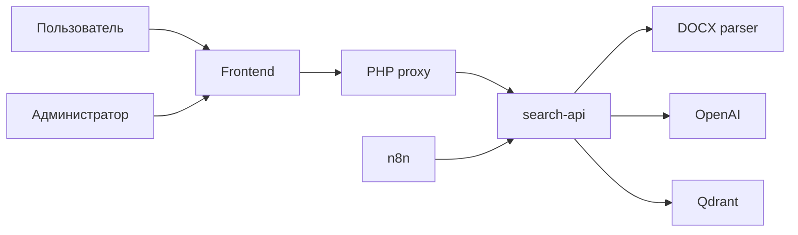

# Regulation Search: краткое описание проекта

## Что это за проект

`Regulation Search` это внутренняя поисковая система по корпоративным регламентам в формате `DOCX`.

Проект нужен, чтобы сотрудник мог не искать ответы вручную по нескольким документам, а задать вопрос в интерфейсе и сразу получить:

- краткий ответ;
- ссылку на источник;
- подтверждающие фрагменты из регламента.

## Какую проблему решает

В корпоративных регламентах часто сложно ориентироваться, потому что:

- документы длинные и неоднородные;
- важные правила находятся не только в тексте, но и в таблицах;
- структура оформлена по-разному;
- ручной поиск занимает время и повышает риск ошибки.

Проект снижает это трение и делает доступ к правилам быстрым и проверяемым.

## Для кого проект

Основные пользователи:

- сотрудники, которым нужно быстро понять правило или порядок действий;
- руководители и владельцы процессов, которые хотят сократить число типовых вопросов;
- администраторы базы знаний, которые загружают новые регламенты и поддерживают индекс в актуальном состоянии.

## Как работает система

1. Администратор загружает `DOCX` в интерфейс.
2. Система разбирает документ на поисковые фрагменты: абзацы, примечания, строки таблиц.
3. Фрагменты индексируются в `Qdrant`.
4. Пользователь задает вопрос на естественном языке.
5. Система выполняет гибридный поиск и возвращает наиболее релевантные фрагменты.
6. Интерфейс показывает краткий ответ и источник.

## Состав компонентов

- Frontend на Beget:
  интерфейс поиска, загрузки документов и контроля состояния коллекции.
- `PHP` proxy:
  same-origin слой между фронтендом и backend.
- `search-api`:
  backend для поиска, загрузки документов и управления коллекцией.
- `DOCX parser`:
  разбирает Word-документы, включая таблицы и многоуровневую нумерацию.
- OpenAI:
  создает dense embeddings и используется для генерации ответа.
- `Qdrant`:
  хранит индекс и выполняет гибридный поиск.
- `n8n`:
  используется как слой оркестрации и расширения сценариев.

## Схема решения

## Почему решение ценно

- Сокращает время поиска правил и процедур.
- Уменьшает число повторяющихся вопросов к владельцам процессов.
- Делает ответы проверяемыми за счет ссылок на источник.
- Позволяет обновлять базу знаний без ручной пересборки интерфейса.
- Подходит для сложных регламентов, где критичны таблицы и структурные разделы.

## Текущий результат

Проект уже включает:

- интерфейс поиска;
- интерфейс загрузки `DOCX`;
- индексацию документов в `Qdrant`;
- показ источников и найденных фрагментов;
- просмотр статуса коллекции и ее очистку;
- основу для расширения сценариев через `n8n`.

## Следующий этап развития

- улучшить качество финального ответа поверх найденных фрагментов;
- добавить журнал загрузок и мониторинг индексации;
- ввести ролевой доступ для административных операций;
- улучшить нормализацию названий документов и версий регламентов.
