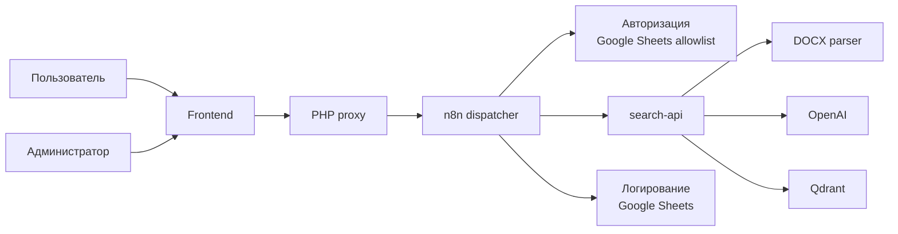

# Regulation Search: краткое описание проекта

## Что это за проект

`Regulation Search` это внутренняя поисковая система по корпоративным регламентам в формате `DOCX`.

Проект нужен, чтобы сотрудник мог не искать ответы вручную по нескольким документам, а задать вопрос в интерфейсе и сразу получить:

- краткий ответ;
- ссылку на источник;
- подтверждающие фрагменты из регламента.

## Документы проекта

- Подробное техническое описание: [PROJECT_DESCRIPTION.md](PROJECT_DESCRIPTION.md)
- Обследование проекта: [Обследование.md](Обследование.md)
- Схема логирования: [LOGGING_SCHEMA.md](LOGGING_SCHEMA.md)
- Runbook деплоя логирования: [LOGGING_DEPLOY_RUNBOOK.md](LOGGING_DEPLOY_RUNBOOK.md)
- Smoke test checklist: [LOGGING_SMOKE_TEST_CHECKLIST.md](LOGGING_SMOKE_TEST_CHECKLIST.md)

## Какую проблему решает

В корпоративных регламентах часто сложно ориентироваться, потому что:

- документы длинные и неоднородные;
- важные правила находятся не только в тексте, но и в таблицах;
- структура оформлена по-разному;
- ручной поиск занимает время и повышает риск ошибки.

Проект снижает это трение и делает доступ к правилам быстрым и проверяемым.

## Для кого проект

Основные пользователи:

- сотрудники, которым нужно быстро понять правило или порядок действий;
- руководители и владельцы процессов, которые хотят сократить число типовых вопросов;
- администраторы базы знаний, которые загружают новые регламенты и поддерживают индекс в актуальном состоянии.

## Как работает система

1. Администратор загружает `DOCX` в интерфейс.
2. Система разбирает документ на поисковые фрагменты: абзацы, примечания, строки таблиц.
3. Фрагменты индексируются в `Qdrant` с dense (семантическими) и sparse (BM25) представлениями.
4. Пользователь задает вопрос на естественном языке и выбирает модель генерации ответа.
5. Запрос проходит через `PHP` proxy и `n8n` dispatcher, который проверяет доступ и маршрутизирует в `search-api`.
6. Система выполняет гибридный поиск и возвращает наиболее релевантные фрагменты.
7. Интерфейс показывает краткий ответ, источник и подтверждающие цитаты.
8. Пользователь может оценить ответ ("Да" / "Нет"), оценка сохраняется в журнал.

## Состав компонентов

- Frontend на Beget:
  интерфейс поиска, загрузки документов, контроля состояния коллекции и feedback.
- `PHP` proxy:
  same-origin слой между фронтендом и `n8n` dispatcher (`search.php`, `upload.php`, `auth.php`, `feedback.php`, `collection.php`).
- `n8n` dispatcher:
  центральный маршрутизатор всех запросов: авторизация, поиск, загрузка, управление коллекцией, feedback. Логирует все действия в Google Sheets.
- `search-api`:
  backend для поиска, загрузки документов и управления коллекцией.
- `DOCX parser`:
  разбирает Word-документы, включая таблицы и многоуровневую нумерацию.
- OpenAI:
  создает dense embeddings (`text-embedding-3-large`) и используется для генерации ответа.
- `Qdrant`:
  хранит гибридный индекс (dense + sparse) и выполняет поиск.

## Схема решения

## Почему решение ценно

- Сокращает время поиска правил и процедур.
- Уменьшает число повторяющихся вопросов к владельцам процессов.
- Делает ответы проверяемыми за счет ссылок на источник.
- Позволяет обновлять базу знаний без ручной пересборки интерфейса.
- Подходит для сложных регламентов, где критичны таблицы и структурные разделы.
- Собирает обратную связь (feedback) для улучшения качества ответов.

## Текущий результат

Проект уже включает:

- интерфейс поиска с выбором модели генерации ответа (GPT-4o mini / GPT OSS 120B);
- интерфейс загрузки `DOCX` с drag-and-drop;
- индексацию документов в `Qdrant` (гибридный поиск dense + sparse);
- показ источников и найденных фрагментов с оценкой релевантности;
- определение fallback-ответов (когда информация не найдена);
- feedback: пользователь может оценить полезность ответа;
- ролевой доступ (admin / editor / viewer) через allowlist;
- логирование всех действий в Google Sheets (авторизация, поиск, загрузка, feedback);
- просмотр статуса коллекции и ее очистку;
- `n8n` dispatcher как центральный маршрутизатор всех API-запросов;
- deploy bundle для быстрого развертывания на Beget.

## Следующий этап развития

- Улучшить качество финального ответа поверх найденных фрагментов.
- Улучшить нормализацию названий документов и версий регламентов.
- Вынести конфигурацию коллекций и политик chunking в отдельный административный слой.
- Добавить merge feedback в `interaction_log` для аналитики.
- Расширить дашборд в Google Sheets для мониторинга качества поиска.
